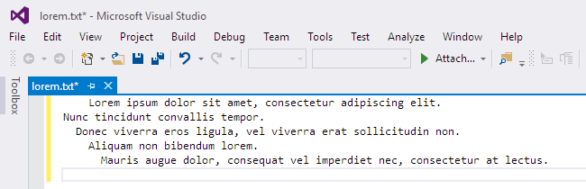

# Reflow

[Download](https://visualstudiogallery.msdn.microsoft.com/00b12458-e1e6-41e6-9cbe-1ac7ba4edb40)

A very simple Visual Studio extension for reflowing a paragraph of text. Simply
select one or more lines of text in the editor and select **Edit** >
**Advanced** > **Reflow Selection** or press **Ctrl+K, Ctrl+Q**. This reformats
all the words such that line breaks are removed from short lines and new line
breaks are inserted before words that cause the line to exceed 80 characters.
Initial white space is preserved and prepended to each line. If nothing is
selected, the current paragraph is formatted.

